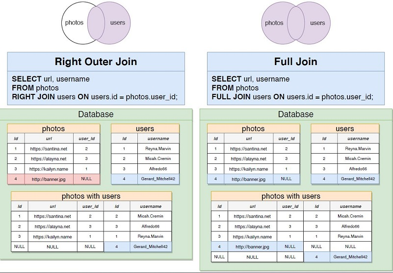
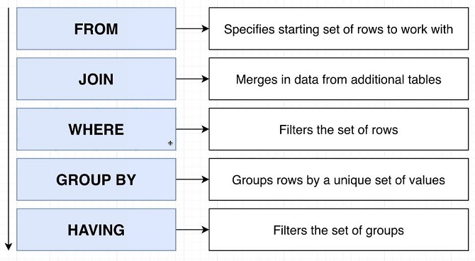

## Create table with auto-generate primary key and foreign key
    CREATE TABLE photos(
      id SERIAL PRIMARY KEY,
      url VARCHAR(200),
      user_id INTEGER REFERENCES users(id)
    );
    
## Insert data into table
    INSERT INTO photos (url, user_id)
    VALUES
    ('http://two.jpg',1),
    ('http://23.jpg',1),
    ('http://2.jpg',4);
    
## Foreign Key Constraints for Deletion
    user_id INTEGER REFERENCES users(id) ON DELETE CASCADE
    user_id INTEGER REFERENCES users(id) ON DELETE SET NULL
    user_id INTEGER REFERENCES users(id) ON DELETE SET DEFAULT
    user_id INTEGER REFERENCES users(id) ON DELETE RESTRICT (Default)
    
## Query with Join Aggregation   
    select contents, username
    FROM comments
    JOIN users ON users.id = comments.user_id

## Four types of Join  

## Count aggregate function
It does not count the NULL values. To fix this issue we can use "*":

    SELECT user_id, COUNT(*) from COMMENTS GROUP BY user_id

## SQL commands order 

## Filtering by "Having" 
    SELECT photo_id, COUNT(*)
    FROM comments
    WHERE photo_id<3
    GROUP BY photo_id
    HAVING COUNT(*) > 10
    
## Order By
By default it is Ascending (ASC)

    select *
    FROM products
    ORDER BY price, weight DESC;

## LIMIT & OFFSET
OFFSET skips the records and LIMIT generates the exact number of records  
LIMIT does not exist in SQL-Server. There are FETCH & TOP instead  
Second & third most expensive phones:

    SELECT name 
    FROM phones
    ORDER BY price desc
    LIMIT 2
    OFFSET 1;

## UNION
Manufacturer(s) that make phones with price less than 170. Also Manufacturer(s) that make more that 2 phones

    SELECT manufacturer FROM phones WHERE price<170
    UNION
    SELECT manufacturer FROM phones GROUP BY manufacturer HAVING COUNT(*)>2
