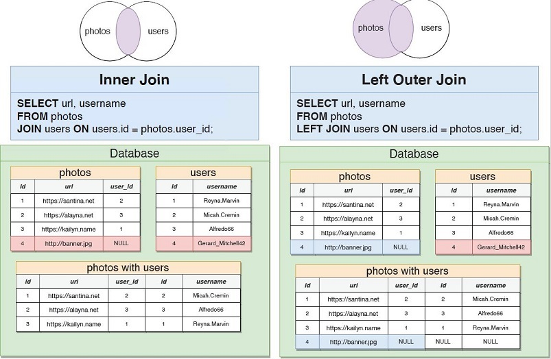

## Create table with auto-generate primary key and foreign key
    CREATE TABLE photos(
      id SERIAL PRIMARY KEY,
      url VARCHAR(200),
      user_id INTEGER REFERENCES users(id)
    );
    
## Insert data into table
    INSERT INTO photos (url, user_id)
    VALUES
    ('http://two.jpg',1),
    ('http://23.jpg',1),
    ('http://2.jpg',4);
    
## Foreign Key Constraints for Deletion
    user_id INTEGER REFERENCES users(id) ON DELETE CASCADE
    user_id INTEGER REFERENCES users(id) ON DELETE SET NULL
    user_id INTEGER REFERENCES users(id) ON DELETE SET DEFAULT
    user_id INTEGER REFERENCES users(id) ON DELETE RESTRICT (Default)
    
## Query with Join Aggregation   
    select contents, username
    FROM comments
    JOIN users ON users.id = comments.user_id

## Four types of Join  

